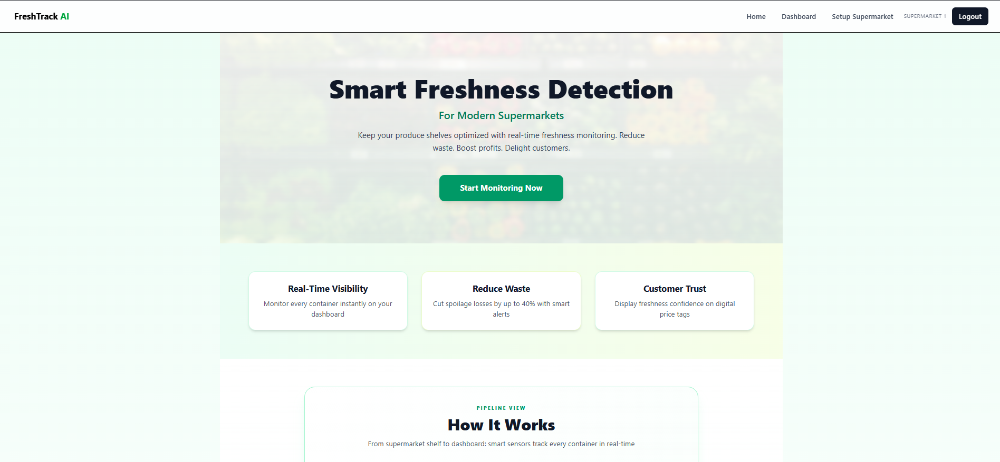
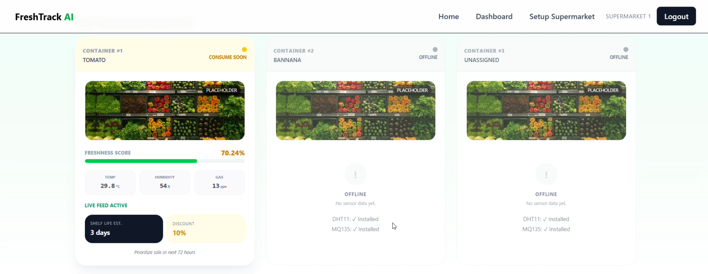
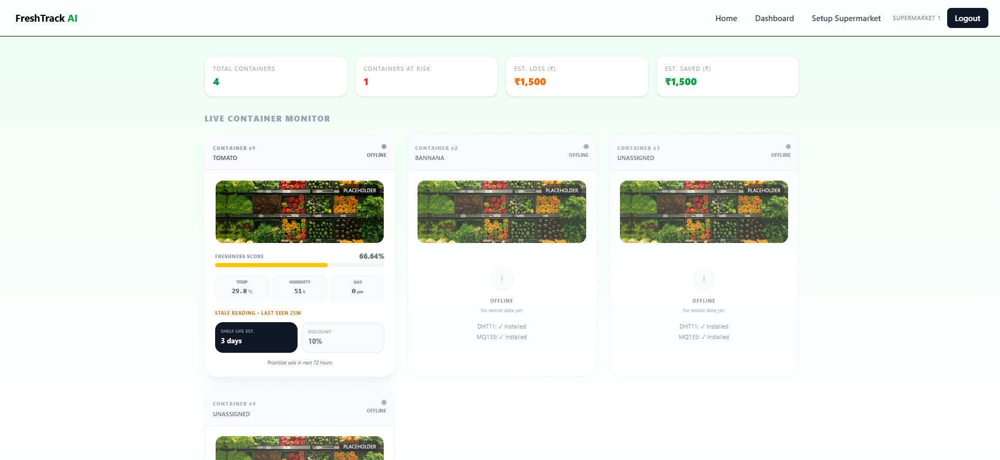

# 🥬 Smart Food Spoilage Detection System
# HARDWARE TEAM - AGRITRIX
### AI-Powered Freshness Monitoring for Perishable Food


---

## 📌 Project Overview

Food spoilage is a major global issue leading to **economic loss, environmental impact, and food insecurity**.
This project introduces a **Smart Food Spoilage Detection System** that monitors the condition of stored fruits and vegetables using **sensor data and AI-based image classification**.

The system combines:

* 🌡 **Sensor Monitoring** (temperature, humidity, gas)
* 🤖 **Machine Learning Image Classification**
* 📊 **Real-time Dashboard Analytics**
* 📡 **IoT-based container monitoring**

The platform provides **real-time freshness scores and spoilage alerts**, helping warehouses, supermarkets, and households reduce food waste.

---

# 🏗 System Architecture

*(Add your architecture diagram screenshot here)*

```
            Food Item
                │
        ┌───────┴────────┐
        │                │
     Camera           Sensors
        │                │
        │           MQ135 / MQ3
        │           Temperature
        │                │
        │              ESP32
        │                │
        └───────┬────────┘
                │
         Data Processing
                │
        ┌───────┴────────┐
        │                │
    YOLOv8 Model    Random Forest
   (image analysis) (sensor analysis)
        │                │
        └───────┬────────┘
                │
          Decision Fusion
                │
        Fresh / Ripe / Spoiled
                │
           Display Output
```

---

# ✨ Key Features

### 🧠 AI-Based Freshness Detection

* Uses a **trained image classification model**
* Detects **fresh vs rotten fruits and vegetables**
* Built using **FastAI deep learning framework**

---

### 📡 Real-Time Sensor Monitoring

Each container continuously monitors:

* Temperature
* Humidity
* Gas concentration
* Timestamped sensor readings

---

### 📊 Live Dashboard

Interactive dashboard displaying:

* Container health status
* Freshness score
* Spoilage alerts
* Monthly spoilage analytics
* Estimated financial savings

---

### ⚠️ Smart Alerts

The system automatically generates alerts when:

* Gas levels indicate spoilage
* Temperature exceeds thresholds
* Freshness score drops below safe levels

---

### 📈 Analytics & Insights

Provides useful insights including:

* Spoilage trends
* Estimated food loss
* Revenue saved through early detection

---

# 🖥 Dashboard Preview

### 📊 Main Dashboard



---

### 📦 Container Monitoring





---

### 📈 Analytics Panel


---

# 🧠 Machine Learning Model

The spoilage detection model was trained using:

| Component | Description              |
| --------- | ------------------------ |
| Framework | FastAI                   |
| Backbone  | ResNet                   |
| Task      | Image Classification     |
| Classes   | Fresh / Rotten           |
| Input     | Fruit & vegetable images |

The model outputs:

```
Prediction: Fresh
Confidence: 0.92
```

---

# ⚙️ Tech Stack

### Frontend

* React
* TailwindCSS

### Backend

* FastAPI
* Python

### Machine Learning

* FastAI
* PyTorch

### Hardware / IoT

* ESP32
* Gas Sensor
* Temperature Sensor
* Humidity Sensor

---

# 📂 Project Structure

```
project-root
│
├── backend
│   ├── main.py
│   ├── model
│   │   └── fruit_classifier.pkl
│
├── frontend
│   ├── src
│   │   ├── components
│   │   ├── pages
│   │   └── Dashboard.jsx
│
├── ml-model
│   └── training_notebook.ipynb
│
└── README.md
```

---

# 🚀 Installation

### 1️⃣ Clone Repository

```
git clone https://github.com/yourusername/food-spoilage-detection.git
cd food-spoilage-detection
```

---

### 2️⃣ Backend Setup

```
cd backend
pip install fastapi uvicorn fastai torch torchvision
```

Run server:

```
uvicorn main:app --reload
```

---

### 3️⃣ Frontend Setup

```
cd frontend
npm install
npm run dev
```

---

# 📡 API Endpoints

### Get Live Container Data

```
GET /containers/live
```

Response:

```
{
  "1": {
    "temperature": 6,
    "humidity": 75,
    "gas": 320,
    "freshness_score": 82
  }
}
```

---

### Image Classification

```
POST /predict
```

Returns:

```
{
  "prediction": "Fresh",
  "confidence": 0.94
}
```

---

# 📊 Future Improvements

* Edge AI inference on IoT device
* Mobile app monitoring
* Cloud deployment
* Automated food pricing based on freshness
* Predictive spoilage modeling

---

# 🌍 Impact

This system helps:

* Reduce food waste
* Improve supply chain efficiency
* Save operational costs
* Promote sustainable food management

---

# 👨‍💻 Author

**Kaushal**
**ARYA K S**
**Gagan M**
**Druva A Shetty**

Engineering Student | AI & Systems Enthusiast

---

# 📜 License

This project is licensed under the **MIT License**.

---
